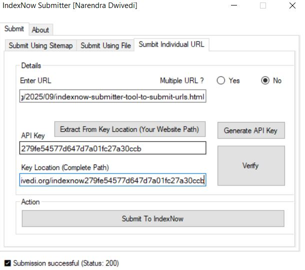

# IndexNow Submitter - A Powerful Desktop Tool for Instant Indexing

**A feature-rich Windows desktop application to instantly submit your website's URLs to the IndexNow API, ensuring rapid discovery by search engines like Bing, Yandex, and more.**

Tired of waiting for search engines to crawl and index your new or updated content? The IndexNow Submitter provides a simple, powerful, and user-friendly interface to directly notify search engines, improving your SEO performance by getting your content indexed in minutes, not days.

---

## ✨ Key Features

This tool is packed with features designed for both beginners and power users:

* **Multiple Submission Modes:**
    * **Sitemap:** Fetch all URLs directly from your `sitemap.xml`.
    * **File:** Load a list of URLs from a local `.txt` file (one URL per line).
    * **Individual:** Paste one or more URLs directly into the application.
* **Complete API Key Management:**
    * **Generate Key:** Create a new, secure 32-character API key with a single click.
    * **Verify Key:** Check if your API key and its location on your server are correctly configured.
    * **Extract Key:** Automatically fetch and fill the API key from its web location.
* **Efficient URL Handling:**
    * **Bulk Selection:** Use the "Select All / Deselect All" checkbox to manage large lists of URLs.
    * **Save URL List:** Export your selected URLs to a `.txt` file for backup or record-keeping.
* **Robust Project Management:**
    * **Save & Open Projects:** Save your settings (API Key, Key Location, Sitemap URL) to a project file, so you don't have to re-enter them every time.
* **Detailed Feedback & Logging:**
    * Get clear success or failure messages for every action.
    * The status bar provides real-time updates on the current process.
    * On submission failure, the application displays the **exact error response** from the IndexNow API for easy troubleshooting.
* **Dynamic UI:** The interface adapts to your needs, such as resizing the textbox for single or multi-line URL input.

---

## ⚙️ Requirements

* **Windows Operating System** (7, 8, 10, 11)
* **.NET Framework 4.7.2 or higher** (This is typically pre-installed on modern Windows systems).

---

## 🚀 Usages

1.  **Download:** Navigate to the **[Releases](https://github.com/NarendraDwivedi/IndexNow-Submitter/releases)** page of this repository and download the latest `.zip` file (e.g., `IndexNow.Submitter.zip`).
2.  **Extract:** Extract the contents of the zip file to a folder on your computer.
3.  **Run:** Double-click `IndexNow Submitter.exe` to launch the application.
    (Requires .NET Framework 4.7.2 or above, usually pre-installed on Windows 10/11).

---

## 📖 Detailed Walkthrough & Full Guide

For a comprehensive guide on how to use every feature of the IndexNow Submitter and to understand the power of instant indexing, please read the full article on my website:

➡️ **[IndexNow Submitter: Your Free Tool to Submit URLs for Faster SEO Results](https://www.narendradwivedi.org/2025/09/indexnow-submitter-tool-to-submit-urls.html)**

---

## ☁️ (Optional) Advanced Setup: Using the Cloudflare Worker & Blogger Integration

For users who want to automate key hosting (no FTP needed!) and even implement IndexNow on their Blogger website, you can deploy a free Cloudflare Worker.

  
Click to view Cloudflare Worker details

  ### What it Does
  This script, when deployed, creates two powerful endpoints on your domain:
  1.  `https://your.domain/indexnow/generate`: Instantly generates a new API key.
  2.  `https://your.domain/indexnowYOUR_KEY`: Acts as the key file itself, accessible via a URL.

  ### How to Deploy & Use with Blogger
  For complete, step-by-step instructions on how to deploy this Cloudflare Worker and integrate IndexNow seamlessly with your Blogger website, please refer to the full guide below.

➡️ **[How to Use IndexNow on Blogger: A Step-by-Step Guide](https://www.narendradwivedi.org/2025/09/how-to-use-indexnow-on-blogger.html)**

---

---

Developed by **Narendra Dwivedi**.
Connect with me:
* [Website](https://www.narendradwivedi.org)
* [LinkedIn](https://linkedin.com/in/narendradwivedi)
* [Instagram](https://instagram.com/thebestnd)
